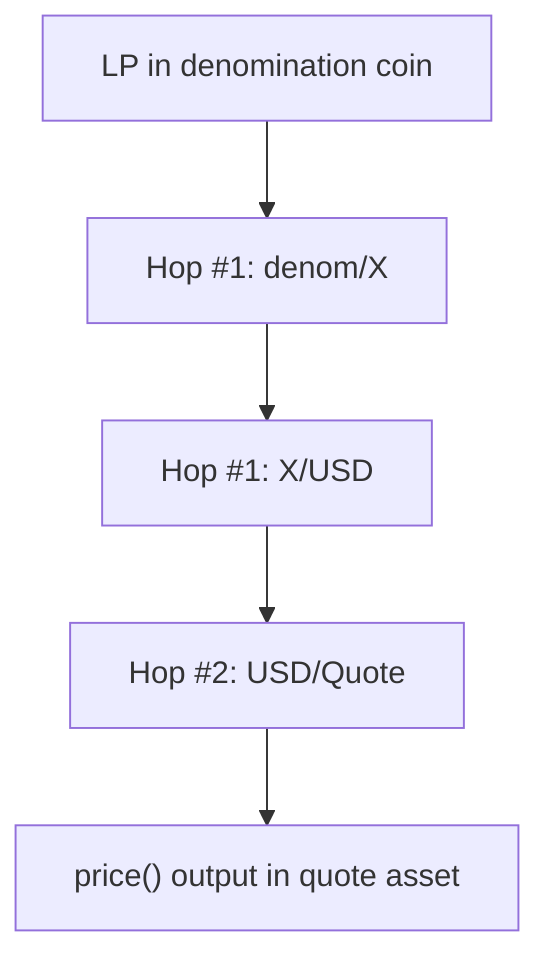

# Curve LP Oracles - Curator Playbook

This guide targets curators evaluating Stake DAO's Curve LP oracles for lending markets. These are market-based oracles: every price comes from Curve's onchain EMA (`price_oracle`) and a Chainlink hop chain, so they track observable trading activity rather than hard-coded pegs or slow-moving NAV values. The document explains how the contracts work, which assumptions keep them safe, how to curate pools, and how to configure deployments without avoidable risk. Both oracle implementations include integration examples at the end of their source files; treat those as canonical references when wiring hop chains.

## TL;DR (Quick Deployment Checklist)

1. Choose the pool and verify upstream risks (issuer, redemption rails, liquidity).
2. Decide the denomination coin (V1 = coin0, V2 = any coin) and ensure there is a reliable USD hop chain.
3. Configure hop feeds (denom -> USD) and quote feed, respecting heartbeats and scaling exponent.
4. Deploy and dry-run the oracle (constructor will revert if feeds are stale).
5. Test on a fork, set LLTV and monitoring alerts (anchor spread, feed freshness, sequencer health).
6. Document emergency actions (kill switch, LLTV cuts, MetaOracle fallback) and publish the market.

## Oracle Interfaces and Versions

Stake DAO maintains two StableSwap oracle variants:

- **V1** denominates every pool in `coin0`. It is audited and powers current markets.
- **V2** lets you pick any pool coin (via `DENOM_INDEX`) as the denomination before converting to the quote asset. It is feature-rich but unaudited, so limit usage to guarded pilots for the moment.

> [!Caution]
> The V2 implementation is **unaudited**. Use V1 (coin0 denomination) in production unless you fully understand the risks and can cap exposure.

Both versions expose the same public interface.

### Public methods

- `price() -> uint256`
  - Returns the value of 1 LP token in the quote asset.
  - Decimals = `ORACLE_SCALING_EXPONENT + decimals(quoteAsset) - 18` (Curve LPs are 18 decimals).
  - Reverts if any hop feed is stale, negative, or missing.
- `decimals() -> uint8`
  - Returns the decimals used by `price()`.

### V1 - Coin0 denomination (audited, production ready)

- Contracts: [`CurveStableswapOracle.sol`](./oracles/CurveStableswapOracle.sol) + [`BaseOracle.sol`](./oracles/BaseOracle.sol). Each file ends with concrete deployment examples (USDC/USDT, wBTC/tBTC, etc.) showing the exact constructor inputs used in production.
- Always denominates the LP in `coin0` before converting to the quote asset.
- Hop chain: `token0ToUsdFeeds` converts `coin0 -> USD`.

**Constructor inputs**

| Parameter                                    | Purpose                                                                             |
| -------------------------------------------- | ----------------------------------------------------------------------------------- |
| `curvePool`                                  | Address of the StableSwap or StableSwap-NG pool (the LP token).                     |
| `quoteAsset`                                 | Asset that debts are denominated in (for example USDC).                             |
| `quoteAssetFeed` + `quoteAssetFeedHeartbeat` | Chainlink feed/heartbeat for quote->USD (omit when `coin0` equals the quote asset). |
| `token0ToUsdFeeds` / `token0ToUsdHeartbeats` | Hop chain converting `coin0` to USD.                                                |
| `scalingExponent`                            | Lending protocol specific exponent (Morpho Blue uses 36).                           |

### V2 - Configurable denomination (experimental, unaudited)

- Contracts: [`CurveStableswapOracleV2.sol`](./oracles/v2/CurveStableswapOracleV2.sol) + [`BaseOracleV2.sol`](./oracles/v2/BaseOracleV2.sol). Integration templates in the files illustrate denomination choices and hop chains for popular pools.
- Adds `DENOM_INDEX`, so the LP can be denominated in any pool coin before the USD/quote conversion.
- Hop chain: `denomToUsdFeeds` converts the chosen denomination coin to USD.
- Includes a constant-time shortcut for 2-coin pools that mirrors V1's logic. This matters because most production Curve pools have exactly two coins, so V2 remains gas-efficient while still supporting larger pools.

**Constructor inputs**

| Parameter                                    | Purpose                                                                                                |
| -------------------------------------------- | ------------------------------------------------------------------------------------------------------ |
| `curvePool`                                  | Address of the StableSwap or StableSwap-NG pool (the LP token).                                        |
| `quoteAsset`                                 | Asset that debts are denominated in.                                                                   |
| `quoteAssetFeed` + `quoteAssetFeedHeartbeat` | Chainlink feed/heartbeat for quote->USD (omit when the denomination coin equals the quote asset).      |
| `denomToUsdFeeds` / `denomToUsdHeartbeats`   | Hop chain converting the denomination coin to USD.                                                     |
| `scalingExponent`                            | Lending protocol specific exponent.                                                                    |
| `denomIndex`                                 | Index of the denomination coin (0 = coin0, 1 = coin1, etc.). Must satisfy `0 <= denomIndex < N_COINS`. |

## How prices are formed

Click to expand the end-to-end calculation

1. **LP Net Asset Value (Curve-side)**
   - `get_virtual_price() = D * 1e18 / totalSupply`, where `D` is the StableSwap invariant over normalized balances (`xp`). Normalization unwraps wrappers (wstETH->stETH, sDAI->DAI) and scales decimals to 18, so the unit of account behaves like the underlying principals.
2. **Conservative denomination**
   - Let `denom = coin[DENOM_INDEX]`. For each pool coin `j`, compute the EMA price of `coin[j]` in `denom` using Curve's `price_oracle`. Take `min(price(j->denom), 1)` across all `j`, then multiply by `get_virtual_price() / 1e18`.
   - V1 has `DENOM_INDEX = 0`, so this reduces to `min(1, price(coin1->coin0), ...) * v`.
   - V2 allows any denomination. Re-denomination uses ratios of `price_oracle` values.
   - The min clamp enforces a lower bound (the oracle never scales `get_virtual_price` upward).
   - **Parity invariant:** the `min(..., 1)` clamp assumes every pool coin trades at or below 1:1 with the denomination coin under normal conditions. This holds for pegged stable pairs (USDC/USDT, wBTC/tBTC) and yield-bearing wrappers (whose appreciation is already absorbed by `get_virtual_price` via `stored_rates`). It does **not** hold for pools where a coin legitimately trades above the denomination coin; in such pools the clamp would permanently suppress the oracle price below fair value. Only onboard pools that satisfy this parity assumption.
3. **Denomination -> USD hops**
   - Multiply the 18-decimal LP-in-denom value by each Chainlink hop feed, dividing out feed decimals in-flight. Heartbeats are enforced per hop.
   - Keep the hop chain as short as possible. Each feed introduces latency, staleness risk, and conversion error.
4. **USD -> quote asset**
   - Divide by the quote asset's USD feed (if needed), then apply the global `SCALE_FACTOR` (`10^(scalingExponent + quoteDecimals + quoteFeedDecimals - 18)`).
5. **Result**
   - `price()` outputs the LP value in the quote asset with the configured precision. If the quote asset equals the denomination coin, the quote feed is skipped and only scaling is applied.

   Full hop chain example:

## Pool curation checklist

Only onboard pools that satisfy **all** of the following:

### Upstream due diligence before oracle config

Before adjusting oracle settings, confirm the asset deserves to be listed. A market-based oracle only reflects trading activity and cannot rescue a fundamentally weak asset. At minimum:

- **Issuer governance/transparency:** know who can pause, mint, or override contracts. Favor assets with public audits or Proof-of-Reserves.
- **Primary and redemption rails:** verify that redemptions or primary-market swaps stay online through stress. Single points of failure (one CeFi desk, one chain) amplify oracle risk.
- **Economic objective:** understand whether the token is a pegged stable, a yield-bearing stable, an LSD, etc. That informs which feeds are appropriate and how quickly they should move.
- **Liquidity depth:** inspect both onchain and offchain order books. If you cannot sell size near the observed price, a market-based oracle will not protect lenders.
- **Oracle responsiveness:** some issuers publish official exchange rates/fundamental ratios. Decide whether to monitor those off-chain or incorporate them via adapters.

Only after the asset passes these checks should you proceed with the oracle configuration below.

1. **Implements `price_oracle`**
   - StableSwap or StableSwap-NG pools expose either `price_oracle()` (2-coin, no arg) or `price_oracle(i)` (N-coin). Pools without it are unsupported.
2. **Healthy liquidity and flow**
   - Curve's EMA `price_oracle` only updates when someone transacts with the pool (swaps, non-proportional adds/removes). Between transactions, the EMA decays toward `last_spot` (the spot price recorded at the time of the last trade), regardless of what happens on external markets. The decay speed is governed by `ma_exp_time` (the pool's EMA time constant, typically 866 seconds in StableSwap-NG). After roughly 5 time constants (~72 minutes for 866s), the EMA has fully converged to `last_spot`.
   - **Why volume matters:** in an active pool, arbitrageurs continuously trade against external prices, injecting fresh spot prices into the EMA every few seconds or minutes. In a quiet pool, `last_spot` can be hours old, and the EMA faithfully converges toward a stale value while external markets diverge. The oracle becomes blind to price movements that happen outside the pool.
   - **Concrete risk for lending:** if a pool asset depegs on external venues but no one trades in the Curve pool, the oracle continues to report a healthy price. Borrowers can take out loans against overvalued LP collateral. By the time someone finally trades (or the curator intervenes), the position may already be underwater. The LLTV buffer must be wide enough to absorb this gap.
   - **Minimum expectations:** verify that the pool receives organic trade flow frequently enough to keep the EMA responsive. A pool that goes hours without a trade is unsuitable. Monitor `ma_last_time` (the timestamp of the last EMA-updating interaction) and alert if the gap exceeds a defined threshold (for example, twice the pool's `ma_exp_time`).
3. **Credible USD feeds for denomination hops**
   - Prefer coins with direct USD feeds or short, well-maintained hop chains.
   - If the denomination coin is a wrapper (wstETH, sDAI, etc.), the first hop **must** price the principal token (stETH, DAI, etc.). `get_virtual_price` already accounts for wrapper rates.
   - Assumption: the token being denominated trades on secondary markets at roughly fair value and is likely to continue doing so. If there is no deep, liquid market, a market-based oracle will not protect lenders. In that case, reconsider listing the asset.
4. **Implementation hygiene**
   - Avoid pools containing native ETH or ERC-777 tokens unless the upstream `get_virtual_price` implementation is protected against read-only reentrancy.
   - **`get_virtual_price` inflation via donation:** directly transferring tokens into a pool contract (without calling `exchange` or `add_liquidity`) can inflate the pool's working balances and push `get_virtual_price` upward without minting new LP tokens. The min clamp does not protect against this because `get_virtual_price` is a multiplier, not a clamped value. Modern StableSwap-NG pools mitigate this by tracking internal balances separately from `balanceOf`, but older plain StableSwap pools may use raw `balanceOf`. Before listing, verify that the pool computes `D` from stored internal balances rather than live token balances to confirm donation attacks cannot inflate `get_virtual_price`.
   - Amplification (A), swap fee, and `offpeg_fee_multiplier` dictate how fast EMA reacts to stress. Extremely high A flattens the curve and hides imbalance until the tail, while very low A makes slippage spike. Abnormally high fees or off-peg multipliers slow correction because each trade is expensive. Favor pools whose parameters match their asset mix and have proven run time.
   - **EMA time constant (`ma_exp_time`):** check the pool's `ma_exp_time` before listing. This parameter controls how quickly `price_oracle` tracks spot price changes. A typical StableSwap-NG value is 866 seconds (~14 minutes). Pools with unusually long time constants will lag more during genuine price movements. Pools with very short time constants are cheaper to manipulate via repeated small trades. Since `ma_exp_time` can be changed by Curve governance, monitor for on-chain parameter updates after listing and reassess the market if the value changes significantly.
   - The oracle inherits Curve's flash-manipulation resistance: `price_oracle` is an EMA and `get_virtual_price` is invariant-based, so single-block flash loans cannot skew readings. Still, avoid pools that have disabled the EMA via governance.
5. **Governance / LP composition**
   - Monitor concentration. Pools dominated by a single LP (>40-50 percent) or top five LPs (>70-80 percent) pose coordination risks.
   - **Post-listing response:** these thresholds must be monitored continuously, not just at onboarding. If concentration breaches occur after listing, consider reducing LLTV or freezing new borrows until the situation resolves. A large concentrated LP withdrawing (especially imbalanced via `remove_liquidity_one_coin`) can simultaneously crash `get_virtual_price`, spike pool imbalance, and destroy the liquidity that arbitrageurs need to keep the EMA accurate. Define escalation thresholds and response playbooks for each market before going live.

## Denomination strategy

### V1 (coin0 only)

- Always denominate in `coin0`. Choose pools where `coin0` has:
  1. A robust USD feed path.
  2. Fundamentals at least as strong as its paired assets.
- Errors to avoid:
  - Coin0 lacking a reliable USD feed -> the hop chain cannot be configured.
  - Configuring hop feeds for wrappers (for example wstETH/USD instead of stETH/USD), which double-counts appreciation.

### V2 (configurable denomination)

1. **Feed quality first**
   - Choose the coin with the strongest USD path (direct feed or shortest credible hop chain). Do **not** pick a weaker path just to be stricter.
2. **Second-order strictness**
   - If both feed paths are solid, consider which coin is more likely to be the cheapest during stress and anchor on the opposite side (so the clamp applies). Monitor both anchors off-chain and alert if the spread widens.
3. **Quote asset match**
   - If the quote asset equals the denomination coin, omit the quote feed entirely. This is cheaper and has fewer failure modes.
4. **Document choices**
   - Update runbooks to highlight which denomination is configured per market and why, so operators know which hop chain drives pricing.
5. **Bounds**
   - Ensure `DENOM_INDEX < N_COINS`. The constructor reverts otherwise.

> **Reminder:** V2 is unaudited. Treat every deployment as experimental until a formal audit completes.

## Stress scenarios to plan for

A market-based oracle reacts as fast as the underlying markets. Curators should still define how the market should absorb stress and who bears the loss. Consider rehearsing these scenarios:

1. **Flash drop & rebound**
   - Example: a volatile asset gaps down 10 percent on a single venue, then recovers within minutes.
   - Response: Curve's EMA smooths one-block manipulation, but the EMA will lag the flash event by design. The real defense is LLTV headroom: the gap between LLTV and the point where bad debt begins must be wide enough that positions remain solvent until the EMA catches up. Chainlink hop feeds typically update on 1-hour or 24-hour heartbeats (not faster), so do not rely on hop feed speed to track intra-hour volatility. Set alerts on EMA vs external spot spreads so off-chain operators can react if the gap exceeds a defined threshold (for example 2-3 percent).
2. **Slow bleed / persistent depeg**
   - Example: a stablecoin drifts 1-2 percent off its peg for hours.
   - Response: Curve's EMA follows actual trades and will reflect the bleed. Monitor anchor spread (coin0 vs coin1 vs external USD feeds) and define deviation + timelock thresholds that trigger LLTV cuts, borrow freezes, or oracle migrations if the market cannot self-correct.
3. **Issuer or wrapper failure**
   - Example: redemptions halt, withdrawal queues explode, or a wrapper custodian is hacked.
   - Response: because the oracle is market-based, prices will plunge as soon as trades print. Have a kill switch or governance path ready to pause borrowing, and document how to unwind positions if the asset trades near zero.

Map each scenario to concrete playbooks (which metrics to watch, who responds, which levers to pull).

## Configuration guidelines

1. **Hop feeds (denom -> USD)**
   - Use heartbeats aligned with the fastest feed in the chain (typically 1-24 hours depending on the asset).
   - Prefer Chainlink feeds with sufficient history and liquidity. Avoid unknown or low-liquidity feeds.
2. **Quote feed**
   - Required when denomination != quote asset. The heartbeat must match the staleness tolerance of the lending market (for example <= 24 hours for USD stables).
3. **Scaling exponent**
   - If used outside Morpho, ensure `scalingExponent + quoteDecimals + quoteFeedDecimals >= 18`. Otherwise the SCALE_FACTOR exponent underflows.
4. **Constructor dry run**
   - Deploy only when all feeds are live. The constructor calls pricing logic and reverts if any hop is stale.
5. **Layer 2 sequencers**
   - Neither oracle includes sequencer uptime guards. If you target an L2, wrap the oracle or extend it to halt when the sequencer is offline, and coordinate with the Stake DAO team before enabling production markets. Read more [here](https://docs.chain.link/data-feeds/l2-sequencer-feeds)

## Metapools and chaining oracles

Metapools pair a stablecoin (`coin0`) against the LP token of another Curve pool (`coin1`). Because both oracle versions rely on Curve's `price_oracle`, they support metapools out of the box as long as the metapool exposes one of the two `price_oracle` variants.

V2 opens an additional option: denominate the metapool LP in `coin1` (the base pool LP) when `coin0` lacks a trustworthy price feed. To do so:

1. Deploy an oracle for the base pool LP, selecting the best denomination for that pool.
2. Wrap that oracle with [`OracleChainlinkAdapter.sol`](./oracles/OracleChainlinkAdapter.sol) so it exposes the Chainlink aggregator interface.
3. Deploy the metapool oracle (V2) with `DENOM_INDEX = 1` and set the first hop in `denomToUsdFeeds` to the adapter address. If the base pool oracle returns prices in the same quote asset needed for the metapool, only that single hop is required.

> **Note:** This chaining approach increases complexity. Use it only when `coin0` lacks a reliable feed, keep hop chains as short as possible, and prefer high-quality data sources. When in doubt, skip the metapool or consult Curve's documentation: https://docs.curve.finance/stableswap-exchange/stableswap-ng/pools/metapool/

## Optional feed adapters

Two experimental adapters are shipped for integrators who need to consume non-Chainlink feeds through a Chainlink-compatible interface:

- [`CurvePriceFeedChainlinkAdapter.sol`](./oracles/CurvePriceFeedChainlinkAdapter.sol) wraps Curve-native price data into the Chainlink aggregator interface so it can be chained as a hop or quote feed.
- [`PythChainlinkAdapter.sol`](./oracles/PythChainlinkAdapter.sol) exposes Pyth price feeds via the Chainlink interface, allowing them to slot into the same hop architecture.

**Warning:** Both adapters are unaudited. Only use them in guarded experiments when no native Chainlink feed is available, and prefer reliable first-party Chainlink data whenever possible.

## Reference configurations

The oracle source files end with full deployment examples. The tables below summarize a few common setups so curators can sanity-check their own parameters.

### V1 (denomination = coin0)

| Pool        | Market (Collateral -> Quote) | Denomination coin | Hop feeds                | Quote feed                |
| ----------- | ---------------------------- | ----------------- | ------------------------ | ------------------------- |
| USDC/USDT   | USDC/USDT LP -> USDC         | `coin0 = USDC`    | None                     | None (quote equals denom) |
| USDT/crvUSD | USDT/crvUSD LP -> USDC       | `coin0 = USDT`    | `[USDT/USD]`             | `USDC/USD`                |
| wBTC/tBTC   | wBTC/tBTC LP -> USDC         | `coin0 = wBTC`    | `[wBTC/BTC, BTC/USD]`    | `USDC/USD`                |
| sUSDS/USDT  | sUSDS/USDT LP -> USDC        | `coin0 = sUSDS`   | `[USDS/USD]` (principal) | `USDC/USD`                |

### V2 (configurable denomination)

| Pool       | Market (Collateral -> Quote)          | `DENOM_INDEX` | Hop feeds                | Quote feed |
| ---------- | ------------------------------------- | ------------- | ------------------------ | ---------- |
| USDC/USDT  | USDC/USDT LP -> USDC (denom = USDT)   | 1             | `[USDT/USD]`             | `USDC/USD` |
| cbBTC/wBTC | cbBTC/wBTC LP -> USDC (denom = cbBTC) | 0             | `[cbBTC/USD]`            | `USDC/USD` |
| cbBTC/wBTC | cbBTC/wBTC LP -> USDC (denom = wBTC)  | 1             | `[wBTC/BTC, BTC/USD]`    | `USDC/USD` |
| sUSDS/USDT | sUSDS/USDT LP -> USDC (denom = sUSDS) | 0             | `[USDS/USD]` (principal) | `USDC/USD` |

Adjust addresses, heartbeats, and scaling exponents to match your deployment environment.

## Errors to avoid

- **Wrong denomination hop:** using wrapper/USD instead of principal/USD double-counts appreciation.
- **Stale feed heartbeats:** forgetting to set per-hop heartbeats removes staleness protection.
- **Underflowing SCALE_FACTOR:** configuring an overly small scaling exponent for a low-decimal quote asset.
- **Coin index mismatch:** providing `DENOM_INDEX >= N_COINS` or misidentifying pool coins.
- **Incorrect hop ordering:** the first feed in `denomToUsdFeeds` must price the denomination coin selected by `DENOM_INDEX`.
- **Ignoring read-only reentrancy:** using pools with native ETH or ERC-777 without verifying the upstream nonReentrant guard.
- **Assuming V2 is audited:** gate access, use caps, and monitor it separately.

## Operational playbook

1. **Monitoring**
   - Track anchor spreads (coin0 vs coin1 vs coin2, etc.) even if only one anchor is on-chain. Alert if the difference exceeds a threshold (for example 1-2 percent).
   - Monitor feed freshness vs heartbeats. Revert or prune markets if feeds go stale.
   - Watch pool TVL, volume, and imbalance (one coin >70-80 percent).
2. **LLTV guidance (rule of thumb)**
   - Tier A pools (deep TVL, blue chip assets, short feeds): 70-75 percent LLTV.
   - Tier B (moderate TVL/volume): 55-65 percent LLTV.
   - Tier C (thin TVL or exotic assets): avoid listing.
   - Lower LLTV when hop chains lengthen, assets carry redemption risk, or pools are LP-concentrated.
   - These LLTV bands are intentionally conservative heuristics. Curators ultimately remain responsible for their own market configurations. Adjust only if you fully understand the liquidation and oracle risks. Stake DAO cannot be responsible for the misconfiguration of a market or the usage of its oracles.
3. **Kill switch / downgrade**
   - Freeze new borrows or cut LLTV when feeds are stale, pool TVL collapses, imbalance spikes, or governance parameters change abruptly.
   - Upgrading from V1 to V2 is optional. If you do so, migrate cautiously because the configuration surface (denomination and hop chains) changes.
4. **Testing**
   - Run fork tests for each deployment block. Log `get_virtual_price`, the denomination min factor, and hop outputs.
   - Simulate off-peg scenarios by overriding feeds to confirm the clamp reduces prices.
5. **Layer 2 awareness**
   - Sequence halts on L2s can leave Chainlink feeds stale. Add sequencer watchdogs or pause logic if you deploy on L2, and let Stake DAO know before activation. Read more [here](https://docs.chain.link/data-feeds/l2-sequencer-feeds)

## Frequently asked questions

**Why is `price()` sometimes equal to `get_virtual_price()`?**

Because the min clamp never scales the virtual price upward. If every EMA ratio is >= 1 in the denomination coin, the LP price equals `get_virtual_price()`.

**Can we mix V1 and V2 markets?**

Yes, but document which denomination each market uses and monitor both anchors. Remember V2 is unaudited.

**How do we pick quote feeds for non-USD assets?**

Use Chainlink feeds that price the quote asset in USD (for example CRV/USD or wETH/USD). If none exist, you need an adapter or wrapper (not provided here).

**Is the oracle compatible with lending protocols other than Morpho?**

Yes. The `scalingExponent` constructor parameter was introduced so integrators can align the oracle output with any protocol's decimal expectations. Morpho uses 36, but you can plug in the exponent your lending venue requires and the SCALE_FACTOR math will adjust accordingly.

**Do these oracles support CryptoSwap pools as well?**

Yes. There is a sibling implementation (`CurveCryptoswapOracle.sol`) for CryptoSwap/TriCrypto style pools. It follows the same BaseOracle scaffolding and exposes identical methods; the main difference is that CryptoSwap pools provide `lp_price()` directly in coin0 units, so the denomination step is simpler.

> [!Caution]
> The oracle implementation responsible of pricing Cryptoswap LP token is **experimental**! It must not be used in production until we greenlights it.

**How do we add sequencer safeguards for L2 deployments?**

Wrap the oracle address with a small adapter that checks the Chainlink sequencer uptime feed before calling `price()`. If the sequencer is down or recently restarted, revert or return a cached value. Stake DAO can assist with reference adapters on request; reach out before listing an L2 market.

**What if a hop feed gets deprecated or replaced?**

Deploy a new oracle instance with the updated hop configuration and migrate the lending market to the new address. Because feeds are constructor-set, you cannot hot-swap them. Always keep a documented migration plan for each market. For immutable lending markets, you will have to migrate from one market to another. Always monitor in production the price feeds you are using.

**Can the oracles be wrapped by a MetaOracle?**

Yes. MetaOracles as described by Steakhouse Financial are controllers that select between multiple feeds (market, NAV, issuer) based on deviation and timelock thresholds. Our EMA-based Curve oracles make excellent market-price backups inside such setups. Plug them in as the fallback feed when the MetaOracle needs to exit slower NAV sources.

## Final checklist before listing a pool

1. [ ] Pool implements `price_oracle`.
2. [ ] TVL and volume meet internal thresholds. No single token dominates the pool.
3. [ ] Denomination coin chosen and hop chain documented. Feeds audited for freshness and liquidity.
4. [ ] Quote feed configured (or intentionally omitted when denomination = quote).
5. [ ] Scaling exponent validated for decimals. `price()` tested on a fork with live data.
6. [ ] LLTV and risk limits set. Monitoring and alerting playbooks updated.

When in doubt, email contact@stakedao.org before promoting a new pool to production.
